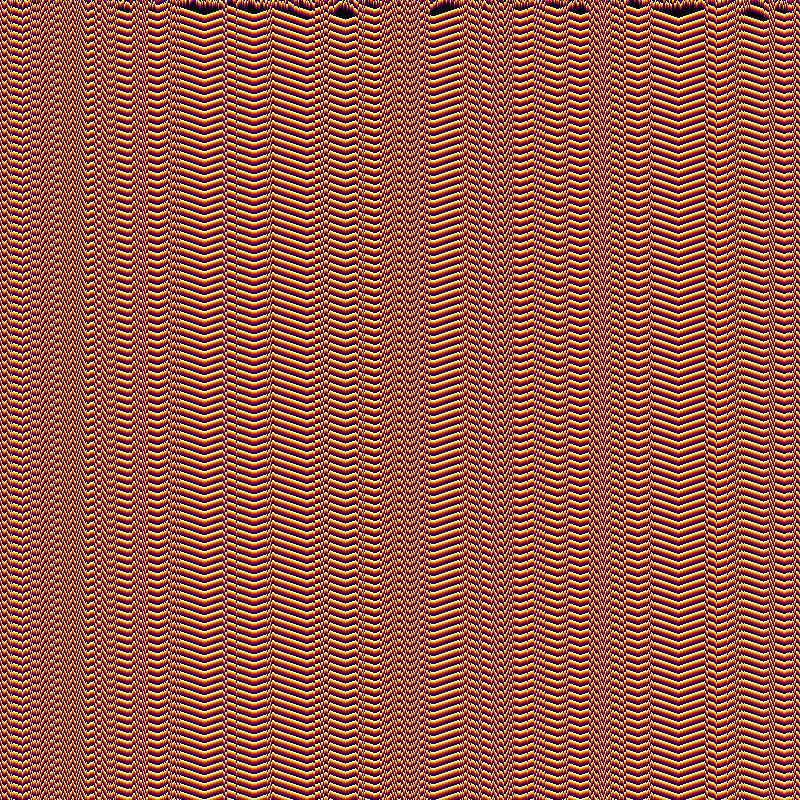

#Complex Cellular Automata Exploration Pipeline

This project is a multi-agent automated pipeline designed to discover, simulate, and visually review novel multi-state cellular automata (CA) rules across many domains, with the goal of discovering new rules that lead to insteresting structural patterns.

The instructions of the orchestrator agent are defined in the `.agentrules` file. You can change the parameters of the pipeline by modifying the `.agentrules` file. The pipeline is divided into 10 loops, each corresponding to a specific domain focus. You can change these domains to other ones or instrucct the LLM to create new ones.



---

## Project Structure


```
├── generations/loop_N/                  # Loop folder (where N is 1 to 10)
│   ├── rules.md             # Rule definitions designed by RuleDesigner subagent
│   ├── generate_ca.py       # Vectorized Python simulation script written by CodeGenerator
│   ├── review_report.md     # Visual analysis and top winner selection by VisualReviewer
│   └── output/              # 20 space-time diagrams (800x800 PNG files)
│       ├── rule_1_single_seed.png
│       ├── rule_1_random.png
│       └── ...
```

### Additional Root Files
- **`make_winners_gif.py`**: A Python script to compile the top 10 winning diagrams into an animated showcase GIF.
- **`.agentrules`**: Standard operating procedures defining the multi-agent pipeline and loop domains.

---


###  Requirements
Ensure you have the required Python packages installed as well as Gemini:
```bash
pip install numpy matplotlib pillow
```

